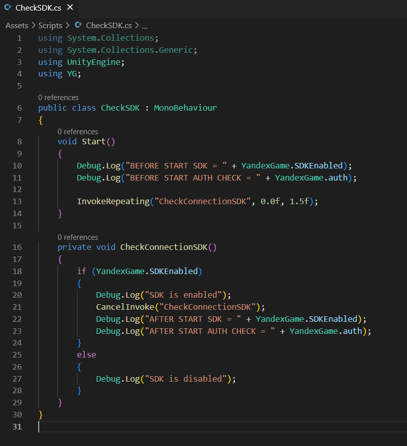
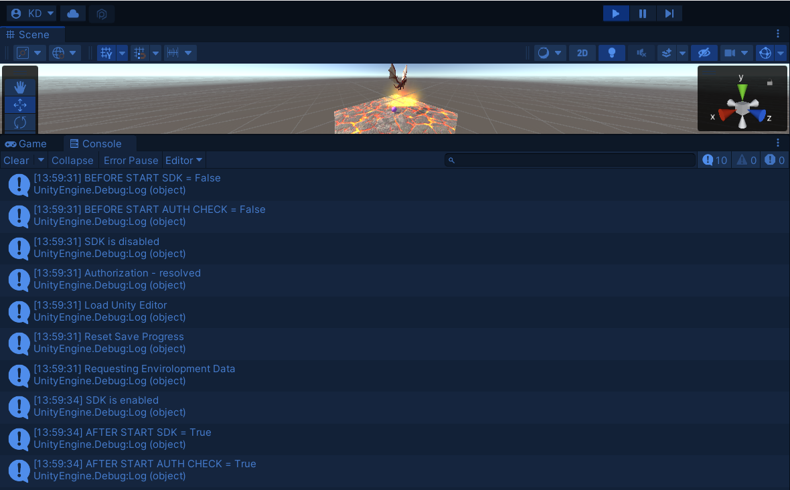

# Интеграция сервиса для получения данных профиля пользователя.
Отчет по лабораторной работе #2 выполнил:
- Кузиев Данил Сергеевич
- РИ-300002

| Задание | Выполнение | Баллы |
| ------ | ------ | ------ |
| Задание 1 | * |   |
| Задание 2 | * |   |
| Задание 3 | * |   |

знак "*" - задание выполнено; знак "#" - задание не выполнено;

<!--   -->

<!--  -->

Структура отчета

- Данные о работе: название работы, фио, группа, выполненные задания.
- Цель работы.
- Задание 1.
- Выполнение задания
- Задание 2.
- Выполнение задания
- Задание 3.
- Выполнение задания
- Выводы.
- Дополнительное.

## Цель работы
Cоздание интерактивного приложения и изучение принципов интеграции в него игровых сервисов.

## Задание 1
### По теме видео практических работ 1-5 повторить реализацию игры на Unity. Привести описание выполненных действий.
Ход работы:

В практических видео и в рамках этой лабораторной, нам нужно было сделать игру "Dragon Picker".

Добавление необходимых префабов, материалов, анимации полета дракону:

Добавили дракону возможность перемещаться в стороны:

Добавление Plane, падение яиц, смена материала яйца:

Добавление яйцу эффекта взрыва при контакте с землёй:

## Задание 2
### В проект, выполненный в предыдущем задании, добавить систему проверки того, что SDK подключен (доступен в режиме онлайн и отвечает на запросы).
Ход работы:

Для выполнения этого задания я воспользовался плагином для Unity - "PluginYG". Данный плагин имеет все необходимые методы для работы с SDK Яндекса.

Для проверки подключения SDK был написан дополнительный скрипт CheckSDK.cs

В документации сказано, что плагин запускается не сразу, поэтому мы раз в полторы секунды будем проверять включение SDK. Если включен - при помощи CancelInvoke мы перестаем проверять включение.

## Задание 3
### Подготовить реферат по результатам выполнения пунктов 1-4.
1.	Произвести сравнительный анализ игровых сервисов Яндекс Игры и VK Game;
2.	Дать сравнительную характеристику сервисов, описать функционал;
3.	Описать их методы интеграции с Unity;
4.	Произвести сравнение, сделать выводы.

Ход работы:

Задание 3 выполнено в виде pdf файла, загруженного в Teams.

## Выводы
- Создали прототип игры
- Немного внесли ясность как работает SDK Яндекса

## Мемчик
  

