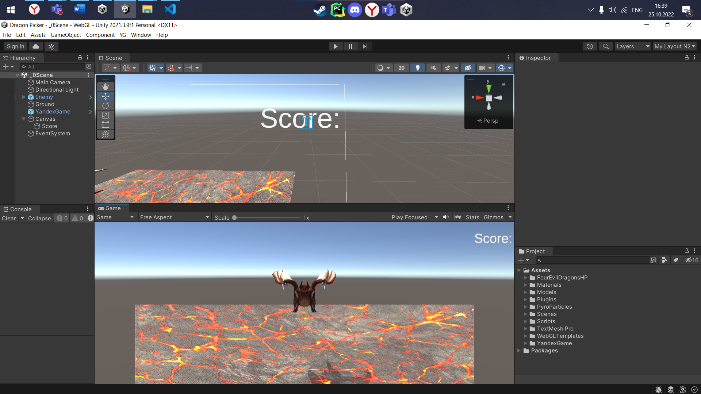
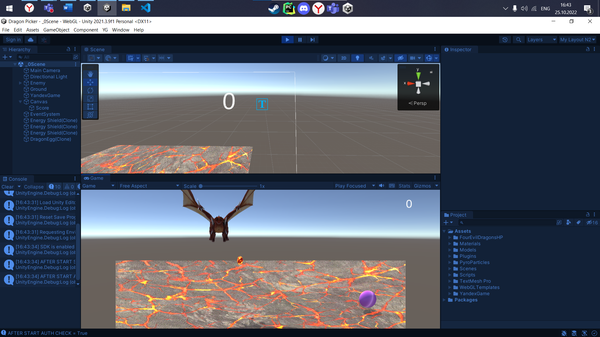
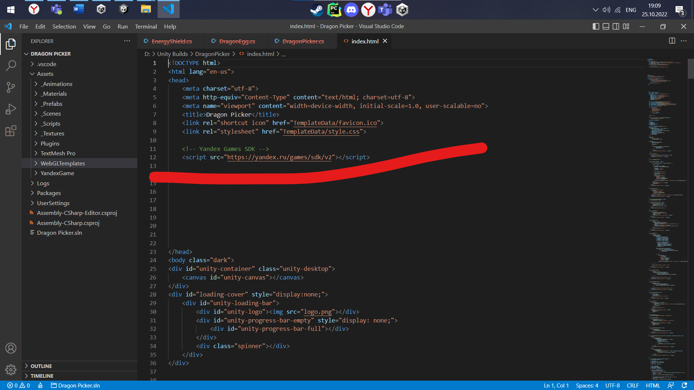
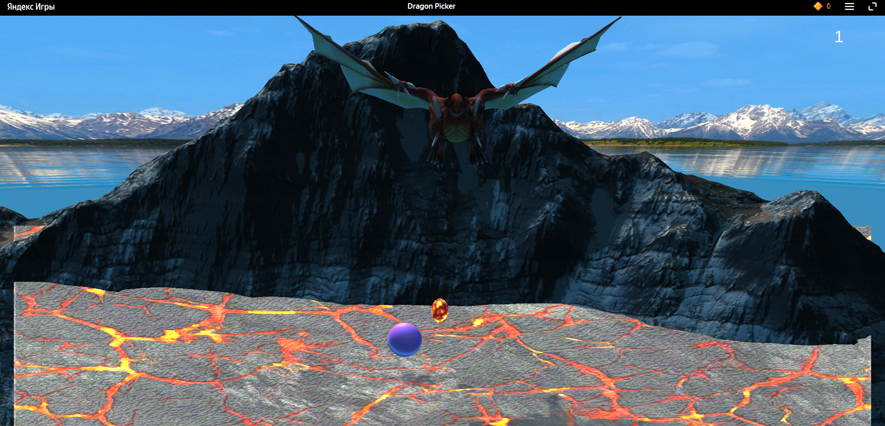

# Реализация интерфейса пользователя.
Отчет по лабораторной работе #2 выполнил:
- Кузиев Данил Сергеевич
- РИ-300002

| Задание | Выполнение | Баллы |
| ------ | ------ | ------ |
| Задание 1 | * | 60 |
| Задание 2 | * | 20 |
| Задание 3 | * | 20 |

знак "*" - задание выполнено; знак "#" - задание не выполнено;

<!--  [](https://nodesource.com/products/nsolid) -->

<!-- [](https://travis-ci.org/joemccann/dillinger) -->

Структура отчета

- Данные о работе: название работы, фио, группа, выполненные задания.
- Цель работы.
- Задание 1.
- Выполнение задания
- Задание 2.
- Выполнение задания
- Задание 3.
- Выполнение задания
- Выводы.
- Дополнительное.

## Цель работы
Интеграция интерфейса пользователя в разрабатываемое интерактивное приложение.

## Задание 1
### Используя видео-материалы практических работ повторить реализацию игровых механик: 
- 1 Практическая работа «Реализация механизма ловли объектов».
- 2 Практическая работа «Реализация графического интерфейса с добавлением счетчика очков».

Ход работы:

Добавили скрипт EnergyShield.cs, где реализовано управление энергетическими щитами с помощью мыши:


В этом же скрипте добавили реакцию на стоклновение: при столкновении яйца с щитом, яйцо уничтожается.


Добавили канвас с текстом, который будет показывать количество очков:


В начале игре количество очков равно нулю (необычно, да?):


Помимо уничтожения, столкновение яйца с щитом теперь увеличивает количество очков:


Если игрок пропускает яйцо, на сцене уничтожаются все активные яйца:


## Задание 2
### Используя видео-материалы практических работ повторить реализацию игровых механик: 
- 3 Практическая работа «Уменьшение жизни. Добавление текстур».
- 4 Практическая работа «Структурирование исходных файлов в папке».

Ход работы:

Добавили уменьшение жизней: каждый раз, когда игрок пропускает яйцо, уменьшается количество энергетических щитов. Если все щиты пропадут, сцена перезапускается.

Также добавили декоративных элементов: Гору и Skybox:


Наведение порядка в папке с проектом:


### Код
При выполнении первых двух заданий были затронуты следующие скрипты:
- EnergyShield.cs
```c#
using System.Collections;
using System.Collections.Generic;
using UnityEngine;
using TMPro;

public class EnergyShield : MonoBehaviour
{
    public TextMeshProUGUI scoreGT;
    
    void Start() 
    {
        var scoreGO = GameObject.Find("Score");
        scoreGT = scoreGO.GetComponent<TextMeshProUGUI>();
        scoreGT.text = "0";
    }

    void Update()
    {
        var mousePos2D = Input.mousePosition;
        mousePos2D.z = -Camera.main.transform.position.z;
        var mousePos3D = Camera.main.ScreenToWorldPoint(mousePos2D);
        var pos = transform.position;
        pos.x = mousePos3D.x;
        transform.position = pos;
    }
    
    private void OnCollisionEnter(Collision other) 
    {
        var collidedObject = other.gameObject;
        if (collidedObject.CompareTag("Dragon Egg"))
        {
            Destroy(collidedObject);
        }
        var score = int.Parse(scoreGT.text);
        score++;
        scoreGT.text = score.ToString();
    }
}
```
- DragonEgg.cs
```c#
using System.Collections;
using System.Collections.Generic;
using UnityEngine;

public class DragonEgg : MonoBehaviour
{
    public static float bottomY = -30.0f;
    
    void Start()
    {
        
    }


    void Update()
    {
        if (transform.position.y < bottomY)
        {
            Destroy(gameObject);
            var apScript = Camera.main.GetComponent<DragonPicker>();
            apScript.DragonEggDestroyer();
        }
    }

    private void OnTriggerEnter(Collider other) 
    {
        var ps = GetComponent<ParticleSystem>();
        var em = ps.emission;
        em.enabled = true;

        var rend = GetComponent<Renderer>();
        rend.enabled = false;

    }
}
```
- DragonPicker.cs
```c#
using System.Collections;
using System.Collections.Generic;
using UnityEngine;
using UnityEngine.SceneManagement;

public class DragonPicker : MonoBehaviour
{
    public GameObject energyShieldPrefab;
    public int numEnergyShield = 3;
    public float energyShieldBottomY = -6.0f;
    public float energyShieldRadius = 1.5f;

    public List<GameObject> shieldList;
    // Start is called before the first frame update
    void Start()
    {
        shieldList = new List<GameObject>();

        for (int i = 1; i <= numEnergyShield; i++)
        {
            var tShieldGo = Instantiate<GameObject>(energyShieldPrefab);
            tShieldGo.transform.position = new Vector3(0, energyShieldBottomY, 0);
            tShieldGo.transform.localScale = new Vector3(1 * i, 1 * i, 1 * i);
            shieldList.Add(tShieldGo);
        }
    }

    // Update is called once per frame
    void Update()
    {
        
    }

    public void DragonEggDestroyer()
    {
        var tDragonEggArray = GameObject.FindGameObjectsWithTag("Dragon Egg");
        foreach (var tGO in tDragonEggArray)
        {
            Destroy(tGO);
        }
        var shieldIndex = shieldList.Count - 1;
        var tShieldGo = shieldList[shieldIndex];
        shieldList.RemoveAt(shieldIndex);
        Destroy(tShieldGo);

        if (shieldList.Count == 0)
        {
            SceneManager.LoadScene("_0Scene");
        }
    }
}
```

## Задание 3
### Используя видео-материалы практических работ повторить реализацию игровых механик: 
- 5 Практическая работа «Интеграция игровых сервисов в готовое приложение».

Ход работы:

Во второй лабораторной лабораторной работе я уже подключал плагин YGPlugin для работы с SDK Яндекса, поэтому у меня уже стоят необходимые настройки для билда (WebGL, Yandex Template)
После билда зайдем внутрь файла index.html:


Подчеркнутая строка показывает, что плагин работает и подключает Yandex SDK.

Так выглядит билд:


Теперь все файлы с build папки необходимо заархивировать в ZIP архиве и в таком виде отправить на проверку в своё черновик приложения. После проверки игру можно открыть, чтобы посмотреть, как она будет выглядеть в Яндекс Играх:


## Выводы
- Доработали игру
- Добавили пользовательский интерфейс
- Научился отправлять свою игру в Яндекс Игры

## Это я делаю лабораторную за несколько часов до дедлайна
  

