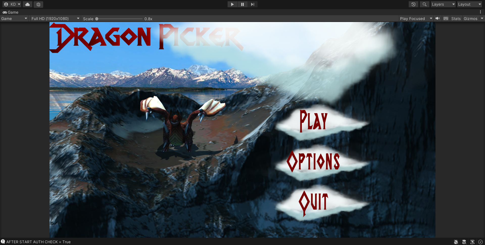

# Доработка интерактивного приложения и его подготовка к сборке
Отчет по лабораторной работе #4 выполнил:
- Кузиев Данил Сергеевич
- РИ-300002

| Задание | Выполнение | Баллы |
| ------ | ------ | ------ |
| Задание 1 | * | 60 |
| Задание 2 | * | 20 |
| Задание 3 | * | 20 |

знак "*" - задание выполнено; знак "#" - задание не выполнено;

<!--   -->

<!--  -->

Структура отчета

- Данные о работе: название работы, фио, группа, выполненные задания.
- Цель работы.
- Задание 1.
- Выполнение задания
- Задание 2.
- Выполнение задания
- Задание 3.
- Выполнение задания
- Выводы.
- Дополнительное.

## Цель работы
Подготовить разрабатываемое интерактивное приложение к сборке и публикации.

## Задание 1
### Используя видео-материалы практических работ 1-5 повторить реализацию приведенного ниже функционала:
-	1 Практическая работа «Создание анимации объектов на сцене»
-	2 Практическая работа «Создание стартовой сцены и переключение между ними»
-	3 Практическая работа «Доработка меню и функционала с остановкой игры»
-	4 Практическая работа «Добавление звукового сопровождения в игре»
-	5 Практическая работа «Добавление персонажа и сборка сцены для публикации на web-ресурсе» 

Ход работы:
Все видеоматериалы были посвящены доработке игры Dragon Picker:
1. Были добавлены анимации и последующая подготовка сцены для главного меню

2. Добавлен канвас, на него навесили UI объекты для взаимодействия с кнопками

3. Ну и собственно реализация взаимодействия: кнопка настроек открывает дополнительное окно с настройками (ниже будет настройка звука),
   кнопка выхода закрывает игру (в редакторе Unity это не показывается), кнопка игры открывает сцену с игрой

## Задание 2
### Продемонстрируйте на сцене в Unity следующее:
- Что произойдёт с координатами объекта, если он перестанет быть дочерним?
  
  
  *Координаты дочернего объекта перестают зависеть от координат родителя.*
  
- Создайте три различных примера работы компонента RigidBody?
  
  
  ExplosionForce
  
  
  AddForce
  
  
  AddTorque (здесь я "заморозил" куб по оси Y, дабы показать крутящий момент)
  

## Задание 3
### Реализуйте на сцене генерацию n кубиков. Число n вводится пользователем после старта сцены.
  
  

## Выводы
- Настроил Unity
- Создал простую сцену
- Изучил работу компонента Rigidbody

## Мемчик
  
