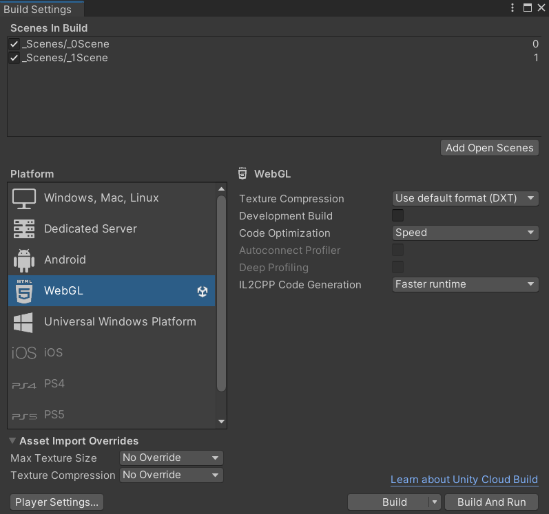

# Доработка интерактивного приложения и его подготовка к сборке
Отчет по лабораторной работе #4 выполнил:
- Кузиев Данил Сергеевич
- РИ-300002

| Задание | Выполнение | Баллы |
| ------ | ------ | ------ |
| Задание 1 | * | 60 |
| Задание 2 | * | 20 |
| Задание 3 | * | 20 |

знак "*" - задание выполнено; знак "#" - задание не выполнено;

<!--   -->

<!--  -->

Структура отчета

- Данные о работе: название работы, фио, группа, выполненные задания.
- Цель работы.
- Задание 1.
- Выполнение задания
- Задание 2.
- Выполнение задания
- Задание 3.
- Выполнение задания
- Выводы.
- Дополнительное.

## Цель работы
Подготовить разрабатываемое интерактивное приложение к сборке и публикации.

## Задание 1
### Используя видео-материалы практических работ 1-5 повторить реализацию приведенного ниже функционала:
-	1 Практическая работа «Создание анимации объектов на сцене»
-	2 Практическая работа «Создание стартовой сцены и переключение между ними»
-	3 Практическая работа «Доработка меню и функционала с остановкой игры»
-	4 Практическая работа «Добавление звукового сопровождения в игре»
-	5 Практическая работа «Добавление персонажа и сборка сцены для публикации на web-ресурсе» 

Ход работы:

Все видеоматериалы были посвящены доработке игры Dragon Picker:
1. Были добавлены анимации и последующая подготовка сцены для главного меню

2. Добавлен канвас, на него навесили UI объекты для взаимодействия с кнопками

3. Ну и собственно реализация взаимодействия: кнопка настроек открывает дополнительное окно с настройками (ниже будет настройка звука),
   кнопка выхода закрывает игру (в редакторе Unity это не показывается), кнопка игры открывает сцену с игрой

4. Добавление звуков, персонажа и его анимации

## Задание 2
### Привести описание того, как происходит сборка проекта проекта под другие платформы. Какие могут быть особенности? 

Ход работы:

Обычно сборка происходит во вкладке Build Settings:

Там выбирается:
- Платформа. На чем эта игра запускается
- Сцены для сборки. Выбираются сцены, которые пойдут в сборку, выбирается их порядок.
Дополнительно можно выбрать опцию Development Build, если это тестовая сборка для дебага.

## Задание 3
### Добавить в меню Option возможность изменения громкости (от 0 до 100%) фоновой музыки в игре.

Ход работы:

Самая простая реализация громкости - через слайдер. У слайдера есть событие OnValueChanged, в котором можно добавить ссылку на AudioListener (она же камера в данной игре), и поставить dynamic volume (volume).

Обычный слайдер выглядит не очень красиво, его можно подделать под стиль игры:

## Выводы
- Больше узнал про анимации в Unity
- Научился реализовать ползунки для настроек
- Научился работать с несколькими сценами

## Мемчик
  
