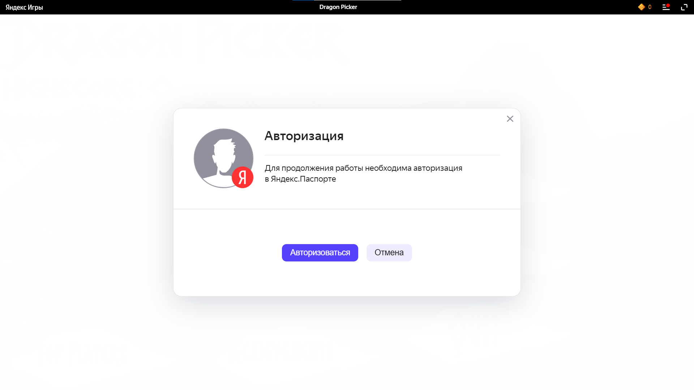
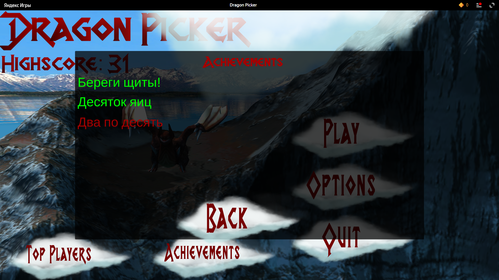
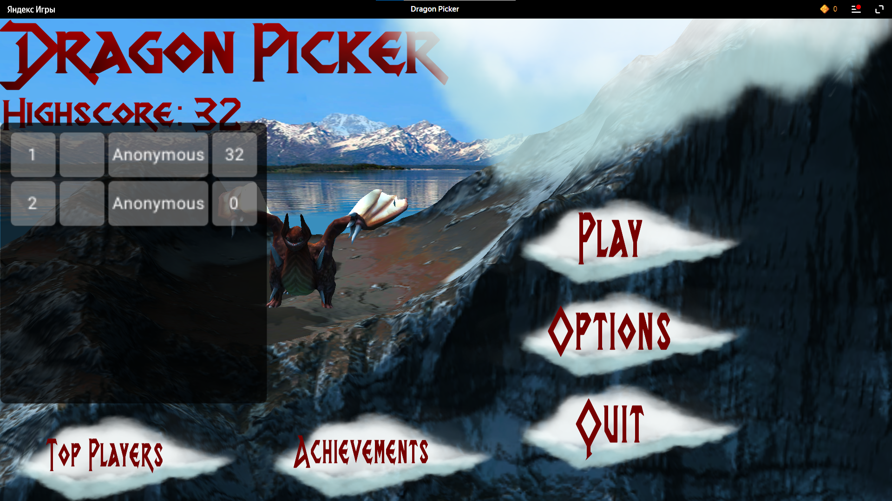

# Создание индивидуальной системы достижения пользователя и ее интеграция в пользовательский интерфейс
Отчет по лабораторной работе #5 выполнил:
- Кузиев Данил Сергеевич
- РИ-300002

| Задание | Выполнение | Баллы |
| ------ | ------ | ------ |
| Задание 1 | * | 60 |
| Задание 2 | * | 20 |
| Задание 3 | * | 20 |

знак "*" - задание выполнено; знак "#" - задание не выполнено;

<!--  [](https://nodesource.com/products/nsolid) -->

<!-- [](https://travis-ci.org/joemccann/dillinger) -->

Структура отчета

- Данные о работе: название работы, фио, группа, выполненные задания.
- Цель работы.
- Задание 1.
- Выполнение задания
- Задание 2.
- Выполнение задания
- Задание 3.
- Выполнение задания
- Выводы.

## Цель работы
Cоздание интерактивного приложения с рейтинговой системой пользователя и интеграция игровых сервисов в готовое приложение.

## Задание 1
### Используя видео-материалы практических работ 1-5 повторить реализацию приведенного ниже функционала:
-	1 Практическая работа «Интеграции авторизации с помощью Яндекс SDK»
-	2 Практическая работа «Сохранение данных пользователя на платформе Яндекс Игры»
-	3 Практическая работа «Сбор данных об игроке и вывод их в интерфейсе»
-	4 Практическая работа «Интеграция таблицы лидеров»
-	5 Практическая работа «Интеграция системы достижений в проект» 

Ход работы:

1. Настроили проверку на авторизацию человека. Если человек не авторизован - его просят авторизоваться, чтобы поиграть.


2. Добавлены поля для сохранения прогресса. Сохранения хранятся в файле saveyg.yg (Само сохранение делается из скрипта SavesYG.cs)
```c#
namespace YG
{
    [System.Serializable]
    public class SavesYG
    {
        // "Технические сохранения" для работы плагина (Не удалять)
        public int idSave;
        public bool isFirstSession = true;
        public string language = "ru";
        public bool promptDone;

        // Тестовые сохранения для демо сцены
        // Можно удалить этот код, но тогда удалите и демо (папка Example)
        public int money = 1;                       // Можно задать полям значения по умолчанию
        public string newPlayerName = "Hello!";
        public bool[] openLevels = new bool[3];

        // Ваши сохранения

        public int score;
        public int highScore = 0;
        public bool[] achievementList = new bool[3];

        // Поля (сохранения) можно удалять и создавать новые. При обновлении игры сохранения ломаться не должны
        // Пока выявленное ограничение - это расширение массива


        // Вы можете выполнить какие то действия при загрузке сохранений
        public SavesYG()
        {
            // Допустим, задать значения по умолчанию для отдельных элементов массива

            openLevels[1] = true;

            // Длина массива в проекте должна быть задана один раз!
            // Если после публикации игры изменить длину массива, то после обновления игры у пользователей сохранения могут поломаться
            // Если всё же необходимо увеличить длину массива, сдвиньте данное поле массива в самую нижнюю строку кода
        }
    }
}
```

3. Благодаря сохранениям, игрок не теряет прогресс, и мы можем данные из файла сохранения переносить в игру.

4. Сделана система ачивок в количестве трёх штук


5. В игру внедрена таблица лидеров, показывает место игрока, иконку, и количество очков


CheckSDK.cs
```c#
using System.Collections;
using System.Collections.Generic;
using UnityEngine;
using YG;
using TMPro;

public class CheckSDK : MonoBehaviour
{
    private void OnEnable() => YandexGame.GetDataEvent += CheckAuthorization;

    private void OnDisable() => YandexGame.GetDataEvent -= CheckAuthorization;

    private TextMeshProUGUI highScoreText;
    void Start()
    {
        Debug.Log("BEFORE START SDK = " + YandexGame.SDKEnabled);
        Debug.Log("BEFORE START AUTH CHECK = " + YandexGame.auth);

        InvokeRepeating("CheckConnectionSDK", 0.0f, 1.5f);
    }
    
    private void CheckConnectionSDK()
    {
        if (YandexGame.SDKEnabled)
        {
            Debug.Log("SDK is enabled");
            CancelInvoke("CheckConnectionSDK");
            Debug.Log("AFTER START SDK = " + YandexGame.SDKEnabled);
            Debug.Log("AFTER START AUTH CHECK = " + YandexGame.auth);

            CheckAuthorization();
        }
        else
        {
            Debug.Log("SDK is disabled");
        }
    }

    private void CheckAuthorization()
    {
        if (YandexGame.auth)
        {
            Debug.Log("OK!");
        }
        else
        {
            Debug.Log("Authorization required!");
            YandexGame.AuthDialog();
        }
        if (GameObject.Find("HighScore"))
        {
            var scoreGO = GameObject.Find("HighScore");
            highScoreText = scoreGO.GetComponent<TextMeshProUGUI>();
            highScoreText.text = $"Highscore: {YandexGame.savesData.highScore.ToString()}";
        }
    }
    
}
```

DragonPicker.cs
```c#
using System.Collections;
using System.Collections.Generic;
using UnityEngine;
using UnityEngine.SceneManagement;
using YG;
using TMPro;

public class DragonPicker : MonoBehaviour
{
    private void OnEnable() => YandexGame.GetDataEvent += GetLoadSave;

    private void OnDisable() => YandexGame.GetDataEvent -= GetLoadSave;

    public GameObject energyShieldPrefab;
    public int numEnergyShield = 3;
    public float energyShieldBottomY = -6.0f;
    public float energyShieldRadius = 1.5f;
    public TextMeshProUGUI scoreGT;
    public TextMeshProUGUI playerNameText;

    public bool[] achievementList = new bool[YandexGame.savesData.achievementList.Length];

    public List<GameObject> shieldList;
    // Start is called before the first frame update
    void Start()
    {
        if (YandexGame.SDKEnabled)
        {
            GetLoadSave();
        }
        shieldList = new List<GameObject>();

        for (int i = 1; i <= numEnergyShield; i++)
        {
            var tShieldGo = Instantiate<GameObject>(energyShieldPrefab);
            tShieldGo.transform.position = new Vector3(0, energyShieldBottomY, 0);
            tShieldGo.transform.localScale = new Vector3(1 * i, 1 * i, 1 * i);
            shieldList.Add(tShieldGo);
        }
    }

    // Update is called once per frame
    void Update()
    {
        
    }

    public void DragonEggDestroyer()
    {
        var tDragonEggArray = GameObject.FindGameObjectsWithTag("Dragon Egg");
        foreach (var tGO in tDragonEggArray)
        {
            Destroy(tGO);
        }
        var shieldIndex = shieldList.Count - 1;
        var tShieldGo = shieldList[shieldIndex];
        shieldList.RemoveAt(shieldIndex);
        Destroy(tShieldGo);

        if (shieldList.Count == 0)
        {
            var scoreGO = GameObject.Find("Score");
            scoreGT = scoreGO.GetComponent<TextMeshProUGUI>();
            achievementList[0] = true;
            GetScoreAchievement(10, 1);
            GetScoreAchievement(20, 2);
            SavingUserData(int.Parse(scoreGT.text), YandexGame.savesData.highScore, achievementList);
            YandexGame.NewLeaderboardScores("TopPlayerScore", int.Parse(scoreGT.text));
            SceneManager.LoadScene("_0Scene");
            GetLoadSave();
        }
    }

    public void GetLoadSave()
    {
        //YandexGame.ResetSaveProgress();
        Debug.Log(YandexGame.savesData.score);
        var playerNameGO = GameObject.Find("PlayerName");
        playerNameText = playerNameGO.GetComponent<TextMeshProUGUI>();
        playerNameText.text = YandexGame.playerName;
        for (var achievementIndex = 0; achievementIndex < achievementList.Length; achievementIndex++)
        {
            achievementList[achievementIndex] = YandexGame.savesData.achievementList[achievementIndex];
        }
    }

    public void SavingUserData(int currentScore, int currentHighScore, bool[] achievementList)
    {
        YandexGame.savesData.score = currentScore;
        if (currentScore > currentHighScore)
        {
            YandexGame.savesData.highScore = currentScore;
        }
        
        for (var achievementIndex = 0; achievementIndex < achievementList.Length; achievementIndex++)
        {
            YandexGame.savesData.achievementList[achievementIndex] = achievementList[achievementIndex];
        }
        YandexGame.SaveProgress();
    }

    private void GetScoreAchievement(int scoreNeeded, int achievementIndex)
    {
        if (int.Parse(scoreGT.text) >= scoreNeeded)
        {
            achievementList[achievementIndex] = true;
        }
    }
}
```

Achievements.cs
```c#
using System.Collections;
using System.Collections.Generic;
using UnityEngine;
using YG;
using TMPro;

public class Achievements : MonoBehaviour
{
    private void OnEnable() => YandexGame.GetDataEvent += GetAchievements;

    private void OnDisable() => YandexGame.GetDataEvent -= GetAchievements;

    private bool[] achievementList = new bool[YandexGame.savesData.achievementList.Length];
    public List<TextMeshProUGUI> achievementText;

    public void SetAchievementCompleting()
    {
        GetAchievements();
        for (var achievementIndex = 0; achievementIndex < achievementList.Length; achievementIndex++)
        {
            if (achievementList[achievementIndex])
            {
                achievementText[achievementIndex].color = Color.green;
            }
        }
    }

    public void GetAchievements()
    {
        for (var achievementIndex = 0; achievementIndex < achievementList.Length; achievementIndex++)
        {
            achievementList[achievementIndex] = YandexGame.savesData.achievementList[achievementIndex];
        }
        Debug.Log(achievementList);
    }
    // Update is called once per frame
    void Update()
    {
        
    }
}
```

## Задание 2
### Описать не менее трех дополнительных функций Яндекс SDK, которые могут быть интегрированы в игру.

Ход работы:

1. Магазин, где можно что-то покупать за внутриигровую валюту или за реальные деньги;
2. Функция вознаграждения за просмотр рекламы: например если игрок потратил все щиты, то за просмотр рекламы можно добавить еще один (или два);
3. Уведомление для игрока, чтобы тот поставил оценку игре;
4. Смена языка на более предпочтительный.


## Задание 3
### Доработать стилистическое оформление списка лидеров и системы достижений, реализованных в задании 1.

Ход работы:

Реализацию этого задания можно увидеть в задании 1. 
Для ачивок выделена отдельная панель, где описываются ачивки и их выполненность: красные ачивки не сделаны, а зеленые выполнены.
Таблица лидеров сделана так, что показывается место, иконка, количество очков игрока.

## Выводы
- Научился работать с сохранениями
- Получил опыт в работе с плагином
- Научился делать таблицы лидеров и внедрять их в игру
